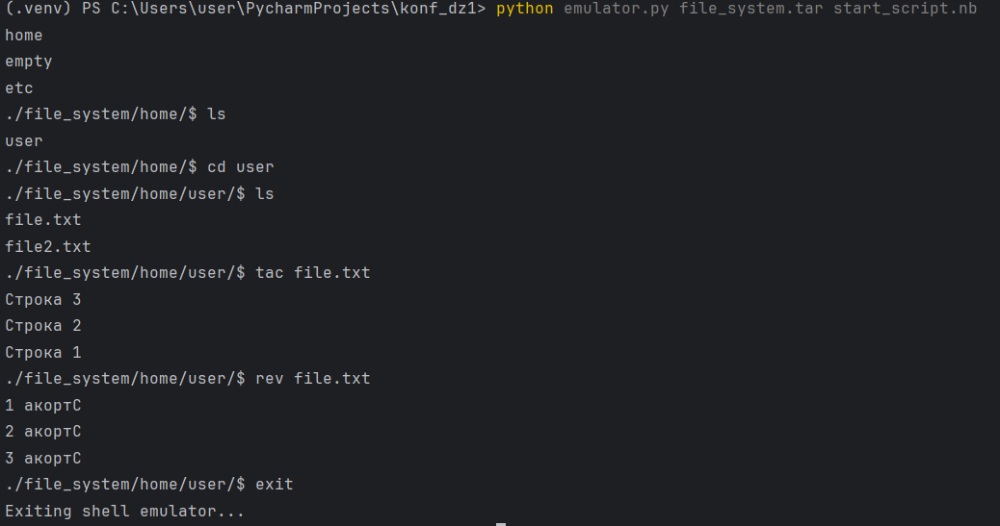
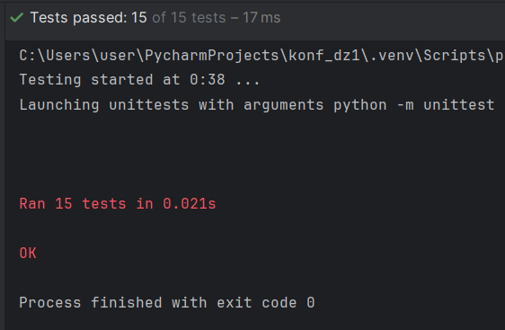

<h1 align="center">Домашние задания по конфигурационному управлению</h1>
<h2>Кузнецова Мария ИКБО-40-23</h2>
<h2>Домашняя работа 1</h2>

<h3>Общее описание задачи</h3>
<body>

Эмулятор для языка оболочки ОС. Работа
эмулятора похожа на сеанс shell в UNIX-подобной ОС.
Эмулятор должен запускается из реальной командной строки, а файл с
виртуальной файловой системой не распаковывается у пользователя.
Эмулятор принимает образ виртуальной файловой системы в виде файла формата
tar. Эмулятор работает в режиме CLI.
 Ключами командной строки задаются:
 • Путь к архиву виртуальной файловой системы.
 • Путь к стартовому скрипту.
 Стартовый скрипт служит для начального выполнения заданного списка
команд из файла.
 Эмулятор поддерживает команды ls, cd, exit, mv, rev, tac.

<h3>Описание работы функций</h3>

<b>Функция ls</b> - команда командной строки для вывода содержимого каталогов. В качестве аргументов ls принимает адреса каталогов или файлов. Если их не передавать, то будет выведено содержимое текущей папки.
 <b>Функция cd</b> - команда командной строки для изменения рабочего каталога.
 <b>Функция mv</b> - команда командной строки, которая используется для перемещения или переименования файлов.
 <b>Функция rev</b> - команда командной строки для изменения порядка следования символов в каждой строке файла на обратный и вывода содержимого указанного файла.
 <b>Функция tac</b> - команда командной строки, которая используется для чтения файла в обратном порядке и отображения содержимого файла с обратными строками.
 <b>Функция exit</b> - команда, завершающая работу эмулятора.
<h3>Пример работы программы</h3>
 
<h3>Результаты тестирования программы</h3>
 
</body>
