<h1 align="center">Домашние задания по конфигурационному управлению</h1>
<h2>Кузнецова Мария ИКБО-40-23</h2>
<h2>Домашняя работа 1</h2>

<h3>Общее описание задачи</h3>
<body>

Эмулятор для языка оболочки ОС. Работа
эмулятора похожа на сеанс shell в UNIX-подобной ОС.
Эмулятор должен запускается из реальной командной строки, а файл с
виртуальной файловой системой не распаковывается у пользователя.
Эмулятор принимает образ виртуальной файловой системы в виде файла формата
tar. Эмулятор работает в режиме CLI.
 Ключами командной строки задаются:
 • Путь к архиву виртуальной файловой системы.
 • Путь к стартовому скрипту.
 Стартовый скрипт служит для начального выполнения заданного списка
команд из файла.
 Эмулятор поддерживает команды ls, cd, exit, mv, rev, tac.

<h3>Описание работы функций</h3>

<b>Функция ls</b> - команда командной строки для вывода содержимого каталогов. В качестве аргументов ls принимает адреса каталогов или файлов. Если их не передавать, то будет выведено содержимое текущей папки.
 <b>Функция cd</b> - команда командной строки для изменения рабочего каталога.
 <b>Функция mv</b> - команда командной строки, которая используется для перемещения или переименования файлов.
 <b>Функция rev</b> - команда командной строки для изменения порядка следования символов в каждой строке файла на обратный и вывода содержимого указанного файла.
 <b>Функция tac</b> - команда командной строки, которая используется для чтения файла в обратном порядке и отображения содержимого файла с обратными строками.
 <b>Функция exit</b> - команда, завершающая работу эмулятора.
<h3>Пример работы программы</h3>
 
<h3>Результаты тестирования программы</h3>
 
</body>
<h2>Домашняя работа 2</h2>

<h3>Общее описание задачи</h3>
<body>

Инструмент командной строки для визуализации графа
зависимостей, включая транзитивные зависимости. Сторонние средства для
получения зависимостей использовать нельзя.
Зависимости определяются по имени пакета языка <b>JavaScript (npm)</b>. Для
описания графа зависимостей используется представление <b>Graphviz</b>.
Визуализатор выводит результат в виде графического
изображения графа в файл graph.png.

 Ключами командной строки задаются:
 • Путь к программе для визуализации графов.
 • Имя анализируемого пакета.
 • URL-адрес репозитория.

<h3>Описание работы программы</h3>

 Визуализатор устанавливает необходимый пакет из указанного репозитория. Имя анализируемого пакета и URL-адрес репозитория
 задаются ключами командной строки. Производится анализ зависимостей. Визуализатор обращается к программе для визуализации графов по 
пути, который задается ключом командной строки. Графическое изображение графа зависимостей указанного пакета находится в файле
graph.png.

<h3>Пример работы программы</h3>
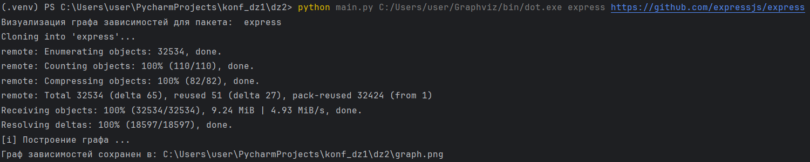 
<h3>Пример вывода программы</h3>
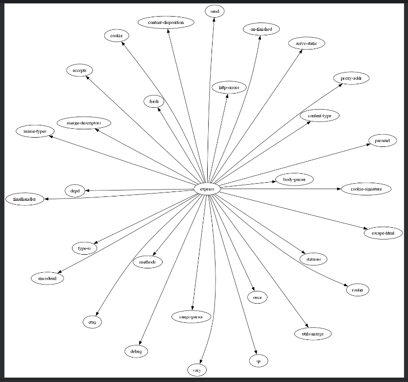 
<h3>Результаты тестирования программы</h3>
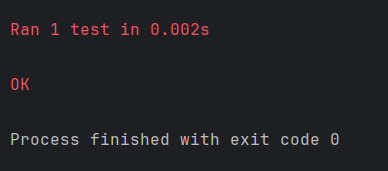 
</body>
<h2>Домашняя работа 3</h2>

<h3>Общее описание задачи</h3>
<body>

Инструмент командной строки для учебного конфигурационного
языка. Этот инструмент преобразует текст из
входного формата в выходной. Синтаксические ошибки выявляются с выдачей
сообщений. Входной текст на языке <b>xml</b> принимается из файла, путь к которому задан
ключом командной строки. Выходной текст на <b>учебном конфигурационном
языке</b> попадает в стандартный вывод.

 Ключами командной строки задаются:
 • Путь к файлу с входным текстом.

<h3>Синтаксис учебного конфигурационного языка</h3>
 Словари:
 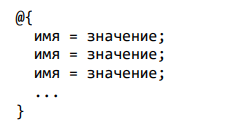 
 Имена: [a-z]+
 Значения:
 • Числа
 • Словари
 Объявление константы на этапе трансляции:
  (define имя значение)
 Вычисление константного выражения на этапе трансляции (префиксная
форма):
  $(операция имя число)
 Результатом вычисления константного выражения является значение.
 Для константных вычислений определены операции и функции:
 • Сложение.
 • Вычитание.
 • abs()(взятие модуля числа).

<h3>Пример работы программы</h3>
 Для входного файла test_2.xml
 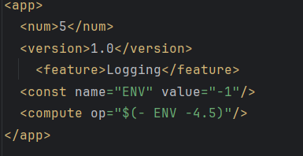 
 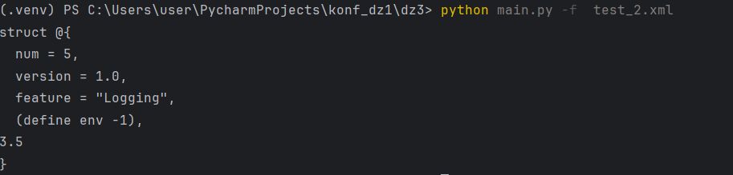
<h3>Результаты тестирования программы</h3>
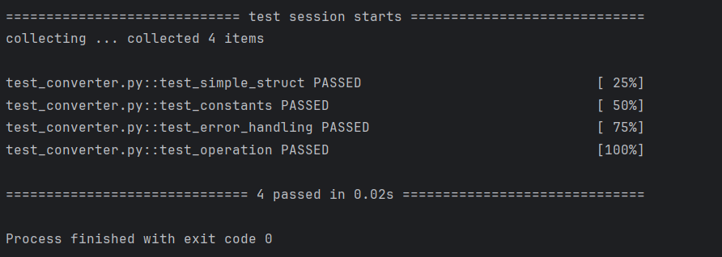 
</body>
<h2>Домашняя работа 4</h2>

<h3>Общее описание задачи</h3>
<body>

Ассемблер и интерпретатор для учебной виртуальной машины
(УВМ). Ассемблер принимает на вход файл с текстом исходной программы, путь к
которой задается из командной строки. Результатом работы ассемблера является
бинарный файл в виде последовательности байт, путь к которому задается из
командной строки. Дополнительный ключ командной строки задает путь к файлу-логу, в котором хранятся ассемблированные инструкции в духе списков
“ключ=значение”, как в приведенных далее тестах.
 Интерпретатор принимает на вход бинарный файл, выполняет команды УВМ
и сохраняет в файле-результате значения из диапазона памяти УВМ. Диапазон
также указывается из командной строки.
 Форматом для файла-лога и файла-результата является json.
 <b>Загрузка константы</b>
 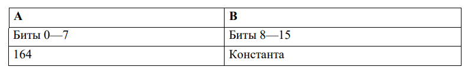 
 Размер команды: 2 байт. Операнд: поле B. Результат: регистр-аккумулятор.
 <b>Чтение значения из памяти</b>
 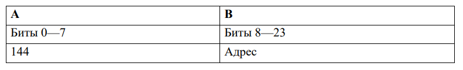 
 Размер команды: 3 байт. Операнд: значение в памяти по адресу, которым
является поле B. Результат: регистр-аккумулятор.
 <b>Запись значения в память</b>
 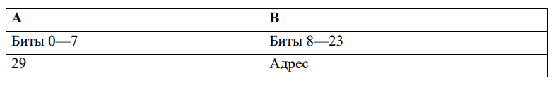 
 Размер команды: 3 байт. Операнд: регистр-аккумулятор. Результат: значение
в памяти по адресу, которым является поле B.
 <b>Бинарная операция: побитовый циклический сдвиг влево</b>
 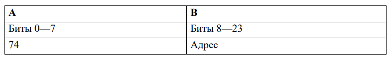 
 Размер команды: 3 байт. Первый операнд: регистр-аккумулятор. Второй
операнд: значение в памяти по адресу, которым является поле B. Результат:
регистр-аккумулятор.

<h3>Пример работы ассемблера</h3>
 Для входной программы test_prog.txt
 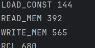 
 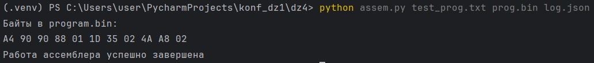 
<h3>Пример работы интерпретатора</h3>
 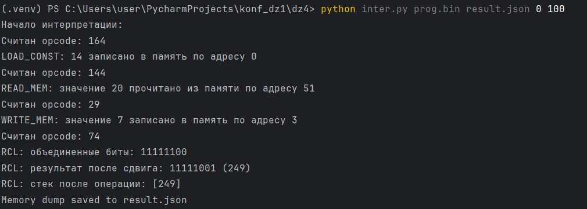